# SignalScope — Full Feature Tutorial

This guide walks you through SignalScope’s UI and all features using the packaged app in `dist/SignalScope.exe`. 

---

## 1) Launching the App

- Open `dist/SignalScope.exe` (double‑click).
- The main window shows a top toolbar, one plot panel (table + plot), and a status bar.

Screenshot: `docs/images/ui-overview.png`
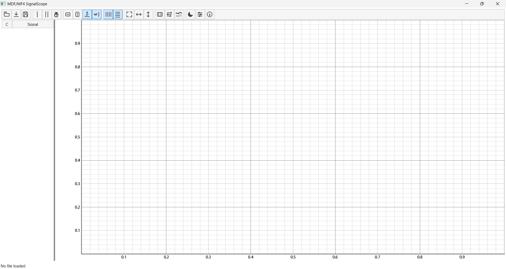

---

## 2) UI Tour

- Toolbar (top): open/load/save session, cursors, snap, zoom/axis controls, grid, fit, columns, signal properties, highlight selected, theme toggle, options, about.
- Plot Panel(s): each panel contains a left signal table and a right plot. Panels stack vertically and share the X axis.
- Status Bar (bottom): shows loaded filename (left) and ΔT readout (right) when difference cursor is active.

Key interactions:
- Double‑click the splitter handle between panels to equalize heights.
- Only the bottom plot shows the X axis labels; it’s also the X‑link master.

Screenshot: `docs/images/panel-anatomy.png`
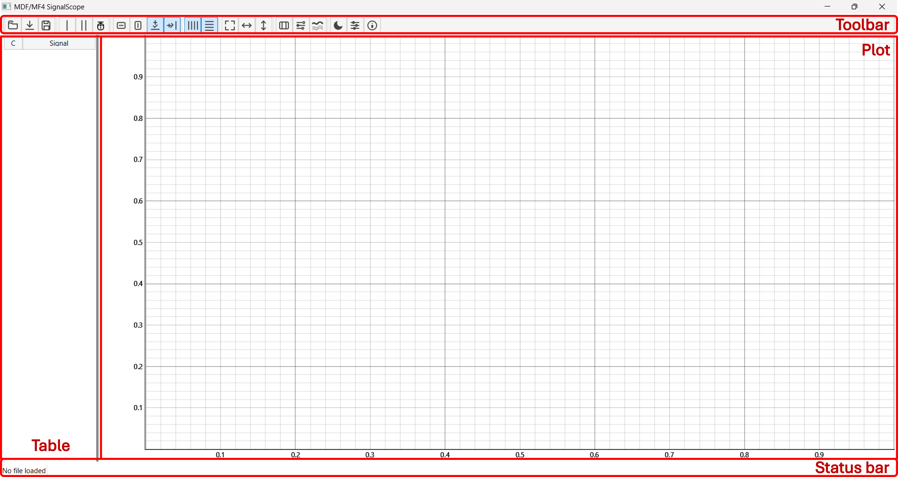

---

## 3) Opening MDF/MF4 Data

- Click Toolbar ➜ Open (folder icon).
- Choose an `*.mf4`/`*.mdf` file; SignalScope loads the file via ASAM MDF (`asammdf`).
- Status bar updates with the filename.

Screenshot: `docs/images/open-dialog.png`
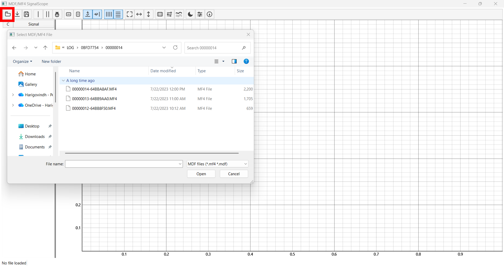

---

## 4) Working with Plot Panels

Right‑click anywhere inside a panel for panel actions:
- Add Signal: open a dialog to pick signals from the loaded file.
- Add Math: create a new math signal from an expression.
- Add New Plot Below: insert another panel under the current one.
- Delete Plot Panel: remove the panel (keeps at least one).
- Delete Selected Signal: remove the selected signal(s) from this panel.

Other layout features:
- Equalize heights: double‑click the vertical splitter between panels.
- Left margins aligned: app auto‑aligns Y‑axis label widths across panels.

Screenshot: `docs/images/panel-context-menu.png`
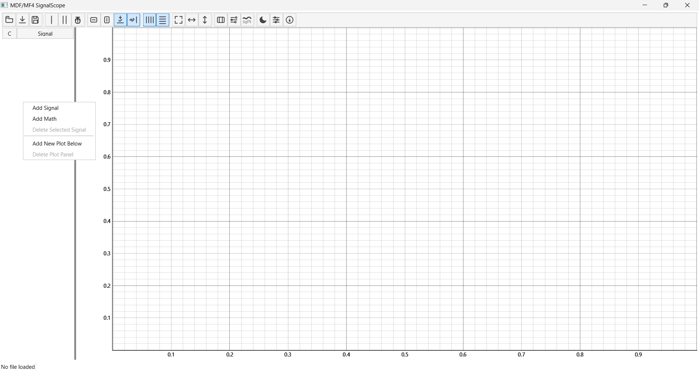

---

## 5) Signal Table

Columns:
- C: color swatch of the curve.
- Signal: display name of the plotted signal.
- Min/Max: whole-data min/max, or min/max within Δ cursor window.
- Y1/Y2: sample values at single/difference cursors.
- ΔY: Y2 − Y1.

Interactions:
- Select a row to update the plot’s left‑axis label and, if highlighting is enabled, emphasize its curve.
- Drag & drop rows to reorder, or drag between panels to move curves.
- Double‑click a signal name or color to open per‑signal editor; math signals prompt whether to edit expression or display properties.

Screenshot: `docs/images/signal-table.png`
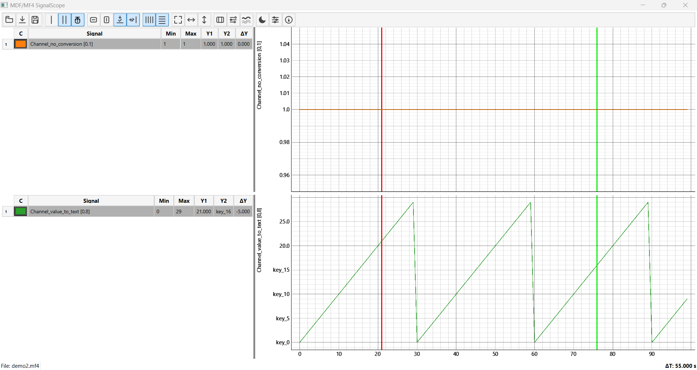

---

## 6) Plot Controls

- Pan: left‑drag when Pan mode is enabled.
- Wheel zoom: scroll wheel (X/Y axes can be independently enabled/disabled).
- Rectangle zoom (axis‑constrained):
  - Enable X Zoom Box or Y Zoom Box in the toolbar, then drag to zoom the chosen axis.
- Grids: toggle X Grid / Y Grid in the toolbar.
- Fit:
  - Fit All: fit XY to all data ranges.
  - Fit X: fit X to data within the visible Y window.
  - Fit Y: fit Y to data within the visible X window.

Screenshot: `docs/images/plot-controls.png`
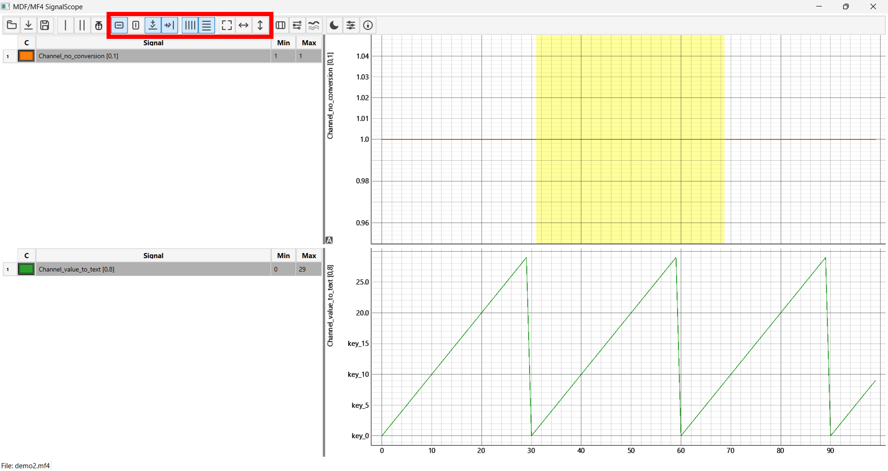

---

## 7) Cursors and Readouts

Modes (toolbar):
- Cursor: single movable vertical cursor; table column Y1 populates with values at X.
- Δ Cursor: two movable vertical cursors; table columns Y1, Y2, and ΔY populate. Status bar shows ΔT with unit scaling (s/ms/µs).
- Snap: toggles snapping cursor(s) to nearest sample X across all curves.

Notes:
- When switching modes, the app emits a refresh so values populate immediately.
- Δ cursor min/max columns show min/max inside the ΔT window.

Screenshot: `docs/images/cursors.png`
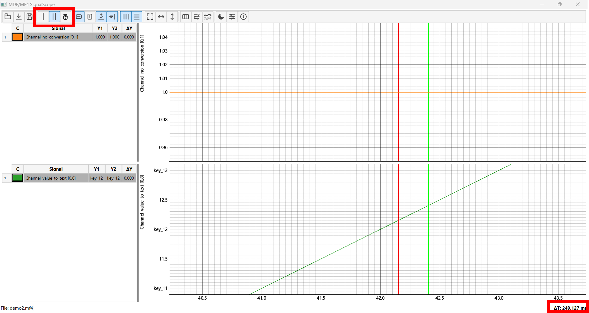

---

## 8) Adding Signals

- Right‑click in a panel ➜ Add Signal.
- Choose one or more signals; they are added to the table and plotted with distinct colors.
- Min/Max compute after data is plotted; table updates automatically.

Screenshot: `docs/images/signal-selection.png`
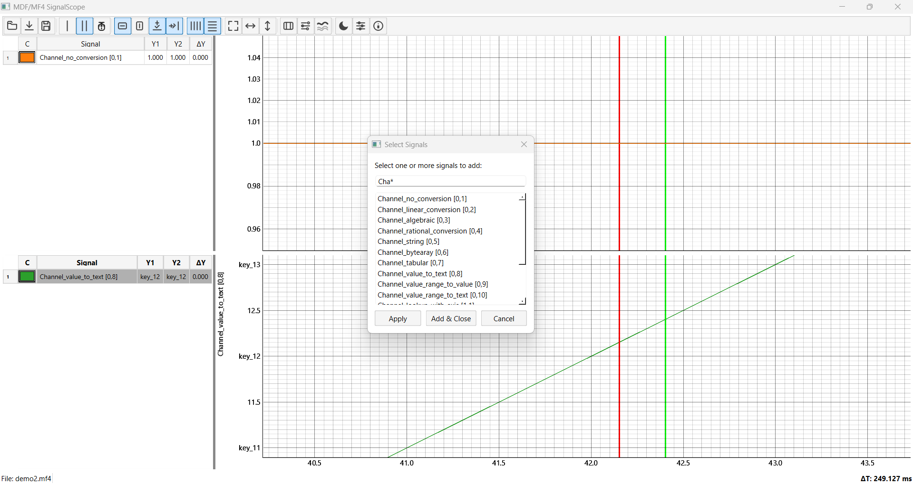

---

## 9) Math Signals

- Right‑click in a panel ➜ Add Math.
- Enter a name and expression (e.g., `AccelX * 9.81` or `mean(Speed, 0.5)` depending on your available functions).
- The app fetches required source signals, resamples them to a common time base, evaluates the expression, and plots the result as a new curve.
- Double‑click a math signal to choose editing the math expression or its display properties.

Screenshot: `docs/images/math-dialog.png`
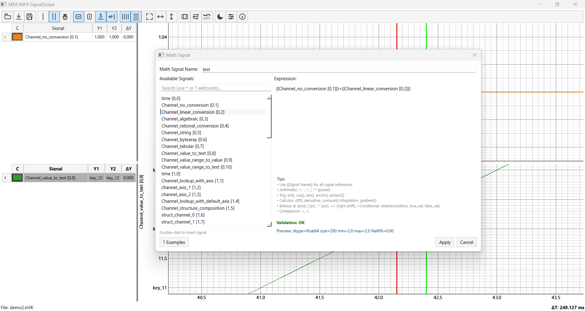

---

## 10) Signal Properties (Styling)

Two ways to edit styling:
- Global Signal Properties Editor (toolbar ➜ Properties): edit multiple signals’ color, marker, linestyle, line width, marker colors.
- Per‑Signal Editor: double‑click a signal’s name/color in the table to edit that one signal.

Effects:
- Line color/width and linestyle update immediately.
- Marker shape, edge and face colors update immediately.
- Theme‑aware colors are respected when toggling light/dark.

Screenshot: `docs/images/properties-editor.png`
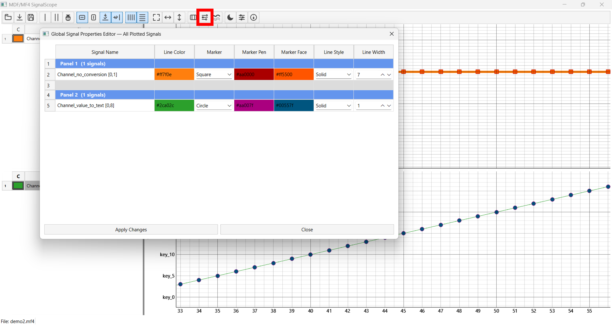

---

## 11) Table Columns Configuration

- Toolbar ➜ Columns: toggle visibility of Min/Max columns.
- The table resizes and the panel’s splitter adjusts to accommodate.

Screenshot: `docs/images/columns-dialog.png`
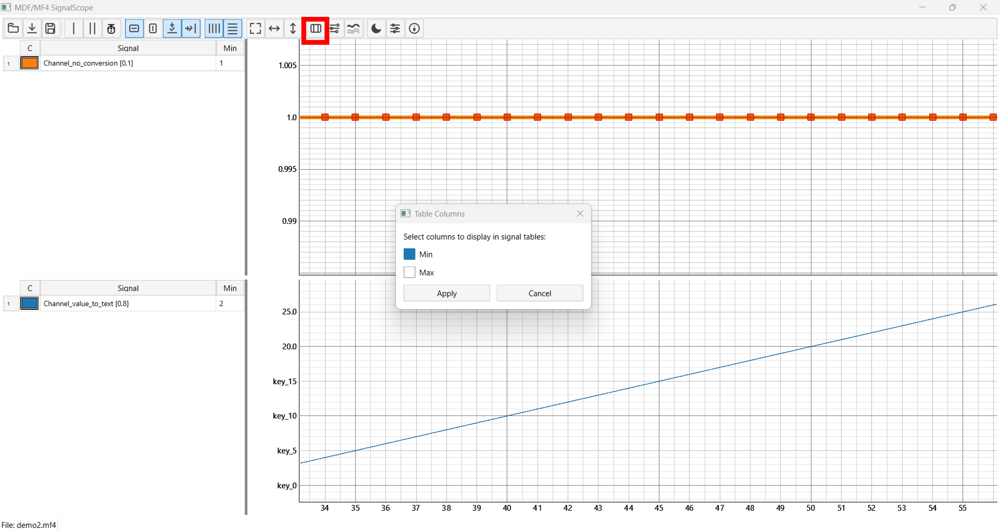

---

## 12) Theme Toggle (Light/Dark)

- Toolbar ➜ 🌙/☀️: toggle dark/light mode.
- The entire UI, including plots and axes, updates immediately.
- The app rebuilds panels safely to apply plot background/colors correctly and preserves view ranges.

Screenshot: `docs/images/dark-mode.png`
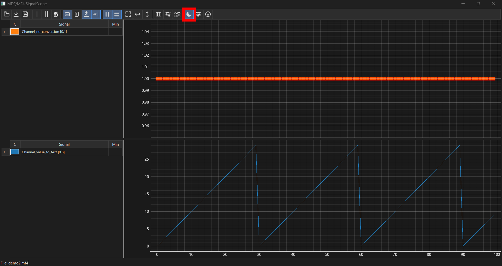

---

## 13) Options / Performance

- Toolbar ➜ Options: adjust performance settings like OpenGL usage, anti‑aliasing, downsampling mode, and update debounce intervals.
- Existing plots update where possible; some changes affect new curves or require data reload for full effect.

Screenshot: `docs/images/options-dialog.png`
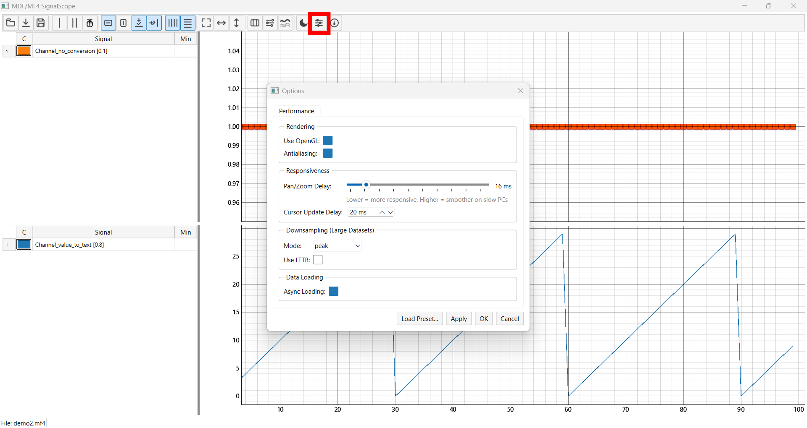

---

## 14) Sessions: Save / Load

- Save Session: toolbar ➜ Save → writes a `.json` containing panels, table/plot split ratios, theme, and plotted signals’ metadata (not raw data).
- Load Session: toolbar ➜ Load → rebuilds UI and re‑adds signals (math signals are re‑evaluated; raw signals fetch from current datasource if available).

Screenshot: `docs/images/save-load.png`
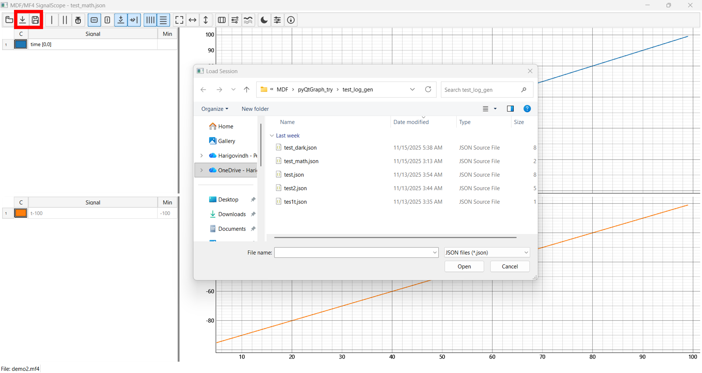

---

## 15) Highlight Selected Curve(s)

- Toolbar ➜ Highlight: emphasizes selected curve(s) in the table; non‑selected curves fade.
- Multi‑select rows in the table to highlight multiple curves.

Screenshot: `docs/images/highlight-selected.png`
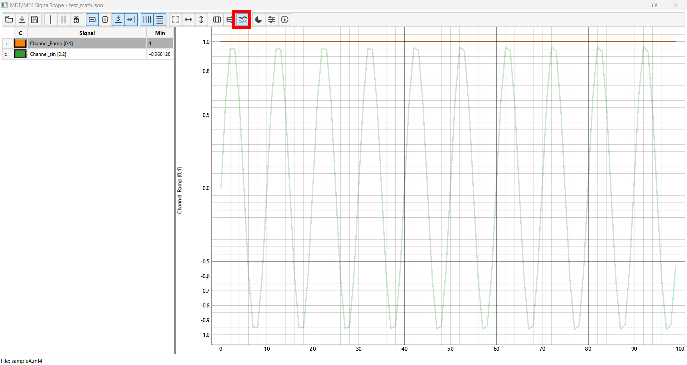

---

## 16) Tips & Shortcuts

- Delete key (table focus): remove selected signal(s) from the panel.
- Drag & drop: move signals within a panel (reorder) or between panels.
- Fit All after adding signals to quickly frame everything.
- Use Snap for precise cursor readings on sampled data.

---

## 17) Troubleshooting

- Missing conversion strings: raw numeric values are shown when conversion tables are not available.
- Greyed‑out signals: table tints unavailable signals when the current MDF file doesn’t contain them.
- Theme flicker on toggle: minor repaint is expected; panels are rebuilt safely and view ranges are preserved when possible.

---

## Appendix

- Supported data: `*.mf4`, `*.mdf` via `asammdf`.
- Value formatting: if conversion tables exist, table values use conversion; otherwise numeric.
- X‑linking: all panels share the X axis; bottom plot is the master for ticks and labels.

